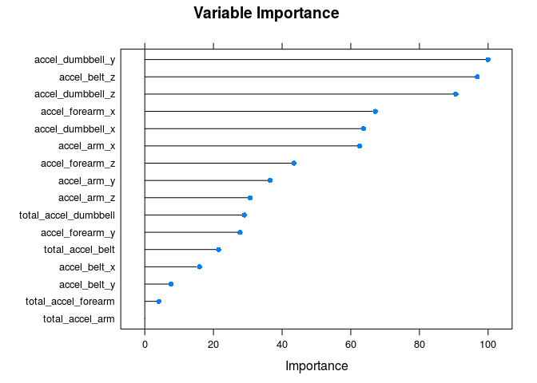

Summary
-------

The aim of the project is to predict the manner in which exercises were
done based on 6 subjects(persons). The training set was split into
training and test which was used as cross-validation. The model chosen
for this project was the random forest model. The accuracy obtained
using the selected model was about 95%.

Data Processing
---------------

The data was processed for activities with accelerometer.

    ## Loading required package: lattice

    ## Loading required package: ggplot2

    ## randomForest 4.6-12

    ## Type rfNews() to see new features/changes/bug fixes.

    ## 
    ## Attaching package: 'randomForest'

    ## The following object is masked from 'package:ggplot2':
    ## 
    ##     margin

An exploratory analysis of the data was done to identify the more
significant features for the model. The process below outlined the steps
that were taken to process and prepare the data for analysis.

    ##  [1] "total_accel_belt"     "var_total_accel_belt" "accel_belt_x"        
    ##  [4] "accel_belt_y"         "accel_belt_z"         "total_accel_arm"     
    ##  [7] "var_accel_arm"        "accel_arm_x"          "accel_arm_y"         
    ## [10] "accel_arm_z"          "total_accel_dumbbell" "var_accel_dumbbell"  
    ## [13] "accel_dumbbell_x"     "accel_dumbbell_y"     "accel_dumbbell_z"    
    ## [16] "total_accel_forearm"  "var_accel_forearm"    "accel_forearm_x"     
    ## [19] "accel_forearm_y"      "accel_forearm_z"      "classe"

    ## 'data.frame':    19622 obs. of  21 variables:
    ##  $ total_accel_belt    : int  3 3 3 3 3 3 3 3 3 3 ...
    ##  $ var_total_accel_belt: num  NA NA NA NA NA NA NA NA NA NA ...
    ##  $ accel_belt_x        : int  -21 -22 -20 -22 -21 -21 -22 -22 -20 -21 ...
    ##  $ accel_belt_y        : int  4 4 5 3 2 4 3 4 2 4 ...
    ##  $ accel_belt_z        : int  22 22 23 21 24 21 21 21 24 22 ...
    ##  $ total_accel_arm     : int  34 34 34 34 34 34 34 34 34 34 ...
    ##  $ var_accel_arm       : num  NA NA NA NA NA NA NA NA NA NA ...
    ##  $ accel_arm_x         : int  -288 -290 -289 -289 -289 -289 -289 -289 -288 -288 ...
    ##  $ accel_arm_y         : int  109 110 110 111 111 111 111 111 109 110 ...
    ##  $ accel_arm_z         : int  -123 -125 -126 -123 -123 -122 -125 -124 -122 -124 ...
    ##  $ total_accel_dumbbell: int  37 37 37 37 37 37 37 37 37 37 ...
    ##  $ var_accel_dumbbell  : num  NA NA NA NA NA NA NA NA NA NA ...
    ##  $ accel_dumbbell_x    : int  -234 -233 -232 -232 -233 -234 -232 -234 -232 -235 ...
    ##  $ accel_dumbbell_y    : int  47 47 46 48 48 48 47 46 47 48 ...
    ##  $ accel_dumbbell_z    : int  -271 -269 -270 -269 -270 -269 -270 -272 -269 -270 ...
    ##  $ total_accel_forearm : int  36 36 36 36 36 36 36 36 36 36 ...
    ##  $ var_accel_forearm   : num  NA NA NA NA NA NA NA NA NA NA ...
    ##  $ accel_forearm_x     : int  192 192 196 189 189 193 195 193 193 190 ...
    ##  $ accel_forearm_y     : int  203 203 204 206 206 203 205 205 204 205 ...
    ##  $ accel_forearm_z     : int  -215 -216 -213 -214 -214 -215 -215 -213 -214 -215 ...
    ##  $ classe              : Factor w/ 5 levels "A","B","C","D",..: 1 1 1 1 1 1 1 1 1 1 ...

The features with NA were not considered as these did not show to have
any influence on the outcome of the question at hand.

    #variables to be removed from data
    rm_names<-c("var_total_accel_belt", "var_accel_arm", "var_accel_dumbbell", "var_accel_forearm")
    new_train_data<-train_data[!names(train_data) %in% rm_names]
    str(new_train_data)

    ## 'data.frame':    19622 obs. of  17 variables:
    ##  $ total_accel_belt    : int  3 3 3 3 3 3 3 3 3 3 ...
    ##  $ accel_belt_x        : int  -21 -22 -20 -22 -21 -21 -22 -22 -20 -21 ...
    ##  $ accel_belt_y        : int  4 4 5 3 2 4 3 4 2 4 ...
    ##  $ accel_belt_z        : int  22 22 23 21 24 21 21 21 24 22 ...
    ##  $ total_accel_arm     : int  34 34 34 34 34 34 34 34 34 34 ...
    ##  $ accel_arm_x         : int  -288 -290 -289 -289 -289 -289 -289 -289 -288 -288 ...
    ##  $ accel_arm_y         : int  109 110 110 111 111 111 111 111 109 110 ...
    ##  $ accel_arm_z         : int  -123 -125 -126 -123 -123 -122 -125 -124 -122 -124 ...
    ##  $ total_accel_dumbbell: int  37 37 37 37 37 37 37 37 37 37 ...
    ##  $ accel_dumbbell_x    : int  -234 -233 -232 -232 -233 -234 -232 -234 -232 -235 ...
    ##  $ accel_dumbbell_y    : int  47 47 46 48 48 48 47 46 47 48 ...
    ##  $ accel_dumbbell_z    : int  -271 -269 -270 -269 -270 -269 -270 -272 -269 -270 ...
    ##  $ total_accel_forearm : int  36 36 36 36 36 36 36 36 36 36 ...
    ##  $ accel_forearm_x     : int  192 192 196 189 189 193 195 193 193 190 ...
    ##  $ accel_forearm_y     : int  203 203 204 206 206 203 205 205 204 205 ...
    ##  $ accel_forearm_z     : int  -215 -216 -213 -214 -214 -215 -215 -213 -214 -215 ...
    ##  $ classe              : Factor w/ 5 levels "A","B","C","D",..: 1 1 1 1 1 1 1 1 1 1 ...

Model Selection
---------------

Various models were explored, namely, boosting, rpart, random forest,
linear discriminant analysis and naive bayes, to determine the most
suitable in terms of accuracy.

Evaluating the Accuracy of the Random Forest Model

    set.seed(323)
    rfFit<-train(classe ~ ., data=training, method="rf")
    plot(varImp(rfFit), main = "Variable Importance ")

<!-- -->

    rfprediction<-predict(rfFit, testing)
    #Accuracy
    #Used rf as prediction model; 0.95 accuracy

    #Evaluating the Accuracy of the Boosting Model
    #set.seed(323)
    #gbmfit<-train(classe ~ ., data=training, method="gbm")
    #gbmprediction<-predict(gbmfit, testing)
    #Accuracy
    #confusionMatrix(gbmprediction, testing$classe)   #0.80 accuracy

    #Evaluating the Accuracy of the rpart model
    #set.seed(323)
    #rpartFit<-train(classe ~ ., data=training, method="rpart")
    #rPartprediction<-predict(rpartFit, testing)
    #Accuracy
    #confusionMatrix(rPartprediction, testing$classe)   #0.42  accuracy
    #Used rpart as prediction model; 0.42% accuracy

    #Evaluating the accuracy of the linear discriminant model
    #set.seed(323)
    #ldaFit<-train(classe ~ ., data=training, method="lda")
    #ldaprediction<-predict(ldaFit, testing)
    #Accuracy
    #confusionMatrix(ldaprediction, testing$classe)   #0.  accuracy
    #Used lda as prediction model; 0.51% accuracy

    #Evaluating the accuracy of the Naive Bayes model
    #set.seed(323)
    #nbFit<-train(classe ~ ., data=training, method="nb")
    #nbprediction<-predict(nbFit, testing)
    #Accuracy
    #confusionMatrix(nbprediction, testing$classe)   #0.  accuracy
    #Used nb as prediction model; 0.57% accuracy

Results
-------

Accuracy of Models:

    #Random Forest
    confusionMatrix(rfprediction, testing$classe)

    ## Confusion Matrix and Statistics
    ## 
    ##           Reference
    ## Prediction    A    B    C    D    E
    ##          A 1611   43   17   13    1
    ##          B    7 1043   27    4   12
    ##          C   29   37  970   39    7
    ##          D   24    6   11  904   10
    ##          E    3   10    1    4 1052
    ## 
    ## Overall Statistics
    ##                                           
    ##                Accuracy : 0.9482          
    ##                  95% CI : (0.9422, 0.9537)
    ##     No Information Rate : 0.2845          
    ##     P-Value [Acc > NIR] : < 2.2e-16       
    ##                                           
    ##                   Kappa : 0.9344          
    ##  Mcnemar's Test P-Value : 7.87e-09        
    ## 
    ## Statistics by Class:
    ## 
    ##                      Class: A Class: B Class: C Class: D Class: E
    ## Sensitivity            0.9624   0.9157   0.9454   0.9378   0.9723
    ## Specificity            0.9824   0.9895   0.9769   0.9896   0.9963
    ## Pos Pred Value         0.9561   0.9543   0.8965   0.9466   0.9832
    ## Neg Pred Value         0.9850   0.9800   0.9883   0.9878   0.9938
    ## Prevalence             0.2845   0.1935   0.1743   0.1638   0.1839
    ## Detection Rate         0.2737   0.1772   0.1648   0.1536   0.1788
    ## Detection Prevalence   0.2863   0.1857   0.1839   0.1623   0.1818
    ## Balanced Accuracy      0.9724   0.9526   0.9612   0.9637   0.9843

    #Boosting
    #confusionMatrix(gbmprediction, testing$classe)$overall[1] 

    #RPart
    #confusionMatrix(rPartprediction, testing$classe)$overall[1]

    #Linear Discriminant Model
    #confusionMatrix(ldaprediction, testing$classe)$overall[1]

    #Naive Bayes
    #confusionMatrix(nbprediction, testing$classe)$overall[1]

Conclusion:
-----------

The random forest model is the most accurate model and makes a
prediction of 95% accuracy. However, in a case where scalability
matters, the random forest model might not be a suitable model given the
level of computations it needs to undertake which could result in low
performance. The actual out of sample error rate, given its accuracy, is
5.1%.

